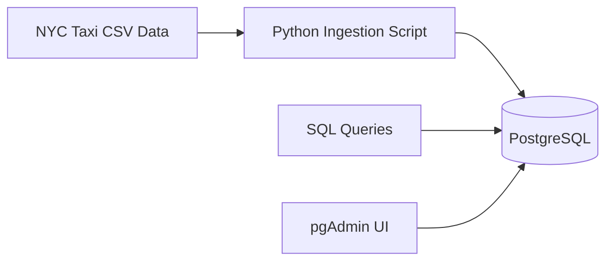
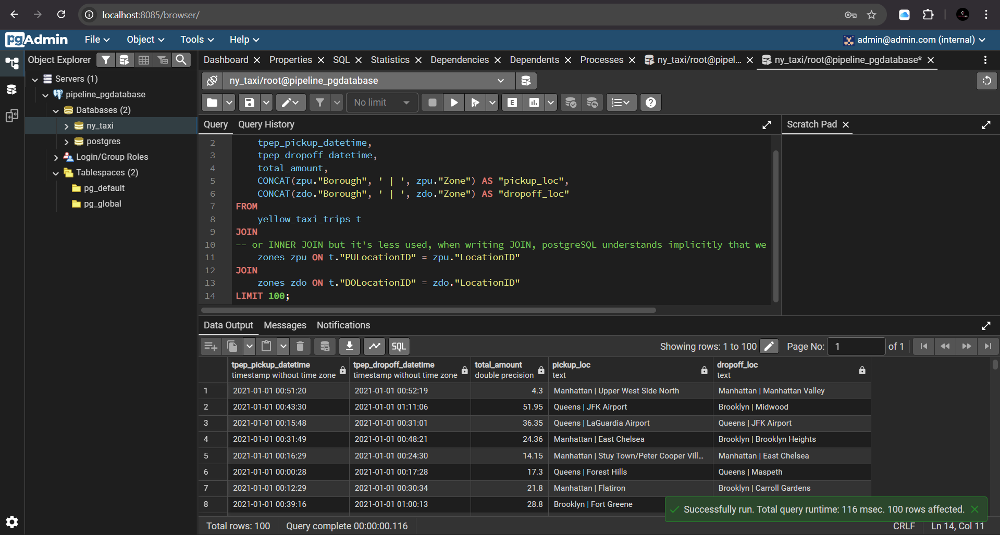
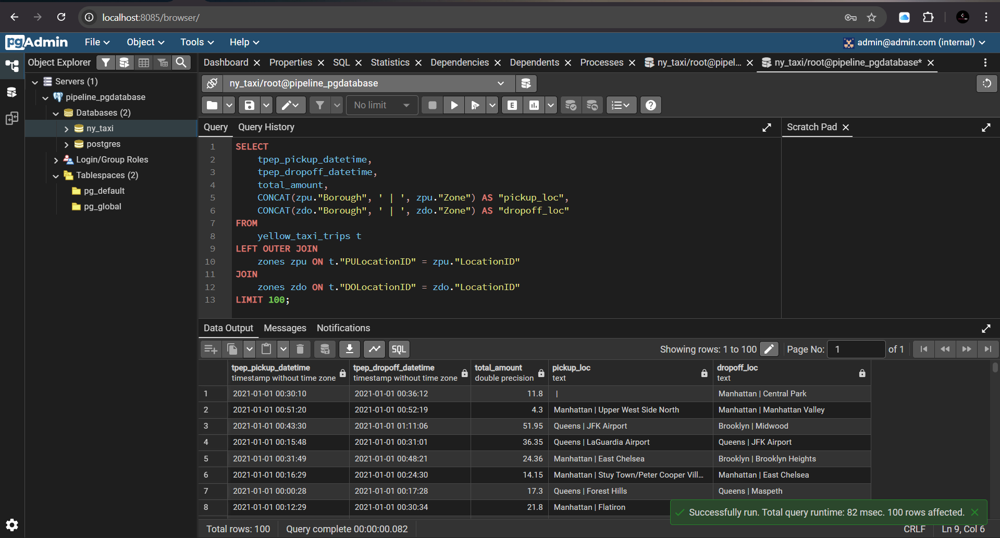
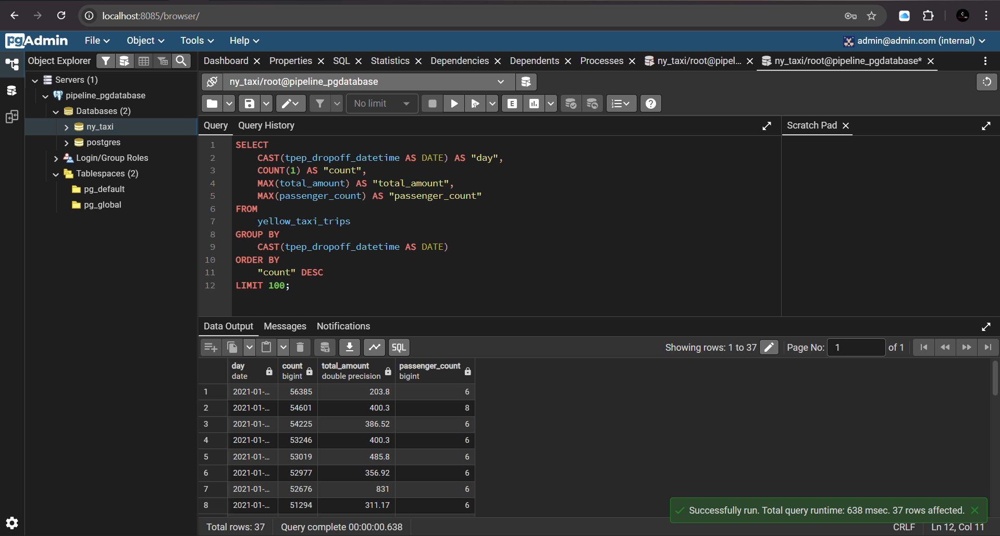

# Week 01 — Docker, SQL & Terraform

## Objective

Build a local, reproducible data ingestion environment using Docker, ingest NYC Taxi data into PostgreSQL, explore it using SQL, and introduce Infrastructure as Code concepts with Terraform.

Establish the foundation for all downstream orchestration, analytics, and streaming work.


## What Was Built

- Dockerized PostgreSQL database
- pgAdmin for database inspection
- Python ingestion script for NYC Taxi data
- SQL-based data exploration
- Terraform project structure (foundations, no cloud resources applied)


## Architecture



## Project Structure

```text
01-docker-terraform/
├── README.md
├── docker-sql/
│   └── pipeline/
│       ├── Dockerfile
│       ├── docker-compose.yaml
│       ├── ingest_data.py
│       └── pyproject.toml
├── terraform/
└── images/
    └── sql/
```

## Technologies Used

- Docker & Docker Compose

- PostgreSQL

- pgAdmin

- Python

- SQL

- Terraform (project scaffolding)

## Docker & PostgreSQL

- PostgreSQL — primary OLTP store

- pgAdmin — UI for inspection and queries

- Python ingestion container — batch loads CSV → Postgres

All services are orchestrated via docker-compose.

## How to Run Locally

```bash
cd 01-docker-terraform/docker-sql/pipeline
docker compose up -d
```

### Verify containers:

```bash
docker compose ps
```

### Access pgAdmin:

- URL: http://localhost:8085

- Email: admin@admin.com

- Password: root

## Data Ingestion

The ingestion script performs:

- CSV download (NYC Taxi Open Data)

- Chunked reads for memory efficiency

- Schema-aware inserts into PostgreSQL

- Explicit dtype handling for timestamps and numerics

### Key file:

```bash
docker-sql/pipeline/ingest_data.py
```

## SQL Exploration

Post-ingestion, SQL was used to validate and explore the dataset:

- Table creation verification

- Row counts and sanity checks

- JOINs with taxi zone lookup data

- Aggregations by zone and time

### SQL Evidence



```markdown
### Explicit INNER JOIN
```

```sql
SELECT
    tpep_pickup_datetime,
    tpep_dropoff_datetime,
    total_amount,
    CONCAT(zpu."Borough", ' | ', zpu."Zone") AS "pickup_loc",
    CONCAT(zdo."Borough", ' | ', zdo."Zone") AS "dropoff_loc"
FROM
    yellow_taxi_trips t
JOIN
-- or INNER JOIN but it's less used, when writing JOIN, postgreSQL understands implicitly that we want to use an INNER JOIN
    zones zpu ON t."PULocationID" = zpu."LocationID"
JOIN
    zones zdo ON t."DOLocationID" = zdo."LocationID"
LIMIT 100;
```


```markdown
### RIGHT JOIN
```

```sql
SELECT
    tpep_pickup_datetime,
    tpep_dropoff_datetime,
    total_amount,
    CONCAT(zpu."Borough", ' | ', zpu."Zone") AS "pickup_loc",
    CONCAT(zdo."Borough", ' | ', zdo."Zone") AS "dropoff_loc"
FROM
    yellow_taxi_trips t
RIGHT JOIN
    zones zpu ON t."PULocationID" = zpu."LocationID"
JOIN
    zones zdo ON t."DOLocationID" = zdo."LocationID"
LIMIT 100;
```


```markdown
### Ordering by Count
```

```sql
SELECT
    CAST(tpep_dropoff_datetime AS DATE) AS "day",
    COUNT(1) AS "count",
    MAX(total_amount) AS "total_amount",
    MAX(passenger_count) AS "passenger_count"
FROM
    yellow_taxi_trips
GROUP BY
    CAST(tpep_dropoff_datetime AS DATE)
ORDER BY
    "count" DESC
LIMIT 100;
```

## Terraform (Foundational)

Terraform is introduced conceptually to establish:

- Project Structure

- Model layout

- Provider configuration patterns

## Key Learnings

- Docker removes environment inconsistencies

- Databases should always run in containers locally

- Never commit data, secrets, or virtual environments

- SQL validation is critical before automation

- Infrastructure should be declarative from day one

## Known Issues & Tradeoffs

- Local volumes must be cleared when switching PostgreSQL versions

- CSV imports via pgAdmin require files to exist inside the container

- PostgreSQL 18 introduces data directory layout changes vs 16

**Back to Parent Project**
[Back to main project overview](../README.md)
