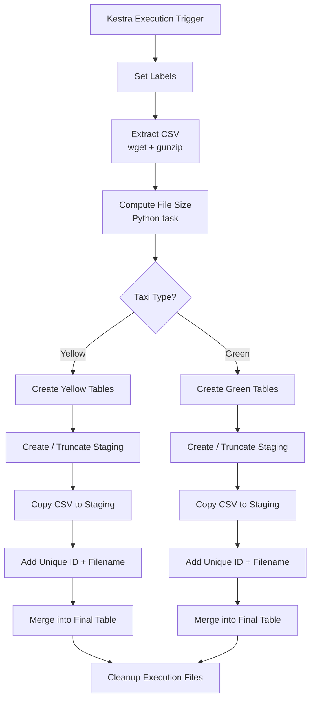
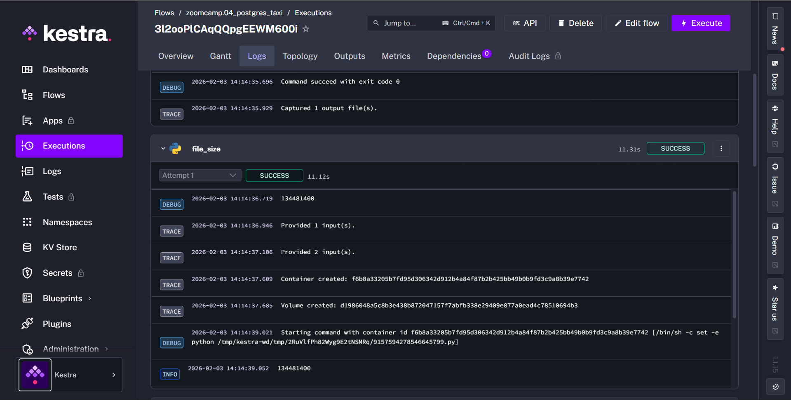
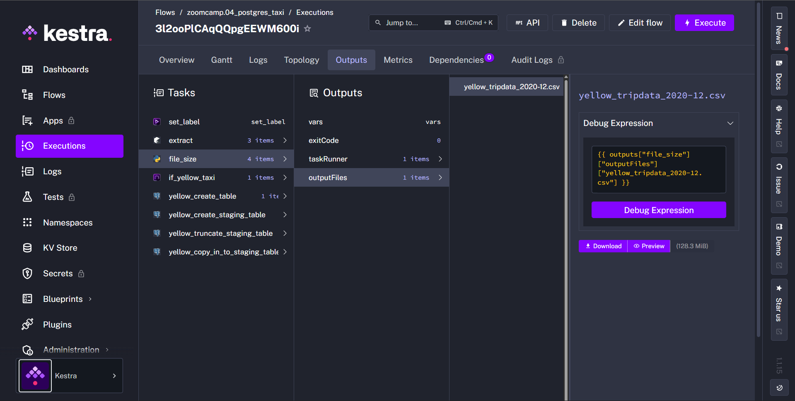

# Week 02 – Workflow Orchestration (Kestra)

This folder contains my Week 2 work for the **DataTalks.Club Data Engineering Zoomcamp (2026 cohort)**.

The focus of this week was workflow orchestration using **Kestra**, building on the Docker and SQL foundations established in Week 1.

---

## Context

After setting up local infrastructure and database ingestion in Week 1, this week introduced orchestration concepts including:

- Parameterized executions
- Variable rendering
- Task-level outputs vs logs
- Scheduling and timezone configuration
- Separating orchestration responsibilities from analytics queries

All flows were executed locally using Docker and the Kestra UI.

---

## Key Flow

### `flows/04_postgres_taxi.yaml`

This is the canonical Zoomcamp ingestion flow with a **minimal, targeted extension** added for Homework 2.

The flow performs the following operations:

- Downloads and extracts monthly NYC Taxi CSV data
- Computes the uncompressed CSV file size using a Python task
- Loads data into PostgreSQL staging tables
- Merges records into final tables with idempotent logic
- Cleans up execution artifacts after completion

The file size computation step was added **only for Homework 2 verification**, without restructuring the original flow.

---

## Workflow Architecture

## Homework 2 Verification

The following homework requirements were validated using this flow.

### File Size (Uncompressed CSV)

- The uncompressed size of `yellow_tripdata_2020-12.csv` was computed programmatically using `os.path.getsize`.
- The authoritative value was retrieved from the **task logs**, not the rounded value shown in the UI.

Evidence:

**File size verification**

---

### Variable Rendering

- Verified correct rendering of the `file` variable based on execution inputs  
  (taxi type, year, and month).
- Rendered values were observed in task logs and resolved filenames during execution.

---

### Row Counts

- Total row counts for Yellow and Green Taxi datasets were computed using SQL queries against PostgreSQL after ingestion.
- Counts were aggregated across full years and specific months as required by the homework.

---

### Scheduling & Timezones

- Reviewed schedule trigger configuration in Kestra.
- Confirmed that timezone handling uses **IANA timezone identifiers** (e.g. `America/New_York`).

---

## Key Learnings

- Workflow orchestration is primarily about **coordination**, not computation. Kestra is responsible for ordering tasks, handling dependencies, and managing execution context, while analytical correctness is validated downstream (e.g. in PostgreSQL).

- Task outputs and task logs serve **different purposes**. Human-readable values shown in the Kestra UI are convenience representations, whereas authoritative values for verification (such as exact file sizes) must be retrieved from task logs.

- Template variables are **rendered at execution time**, not stored as static strings. Understanding when and where rendering occurs is critical for interpreting filenames, labels, and downstream task behavior.

- Conditional branching within workflows (e.g. Yellow vs Green taxi paths) enables reuse of a single orchestration definition while maintaining dataset-specific logic.

- Schedule configuration requires awareness of **timezone semantics**. Kestra uses IANA timezone identifiers rather than offsets or abbreviations, which avoids ambiguity during daylight saving transitions.

- Clear separation between orchestration logic and analytical queries prevents misinterpretation of system responsibilities and reduces the likelihood of incorrect assumptions during validation.

---

## Known Trade-offs

- The workflow prioritizes **clarity and correctness** over optimization. Tasks are executed sequentially to make behavior explicit rather than maximizing parallelism.

- File size verification relies on **task logs** rather than surfaced metrics. This improves accuracy but requires manual inspection during validation.

- Row counts are computed **after ingestion** via database queries rather than during orchestration. This keeps orchestration lightweight but shifts verification responsibility to the data warehouse layer.

- The flow is designed for **local execution** using Docker and Kestra UI. Production hardening (monitoring, retries, alerting, secret management) is intentionally out of scope for this stage of the course.

- Only final artifacts and evidence are included in the repository. This improves signal clarity but omits infrastructure context that would be necessary in a production environment.

## Notes

This repository intentionally includes **only final artifacts and evidence** relevant to the coursework and portfolio signal.  
Execution infrastructure, local configuration files, secrets and runtime logs are excluded by design.

- ⬅️ [Paroject repository](https://github.com/AsherJD-io/nyc-taxi-data-platform)
- ⬅️ [Week 1 – Docker & Terraform](https://github.com/AsherJD-io/nyc-taxi-data-platform/tree/main/01-docker-terraform)
