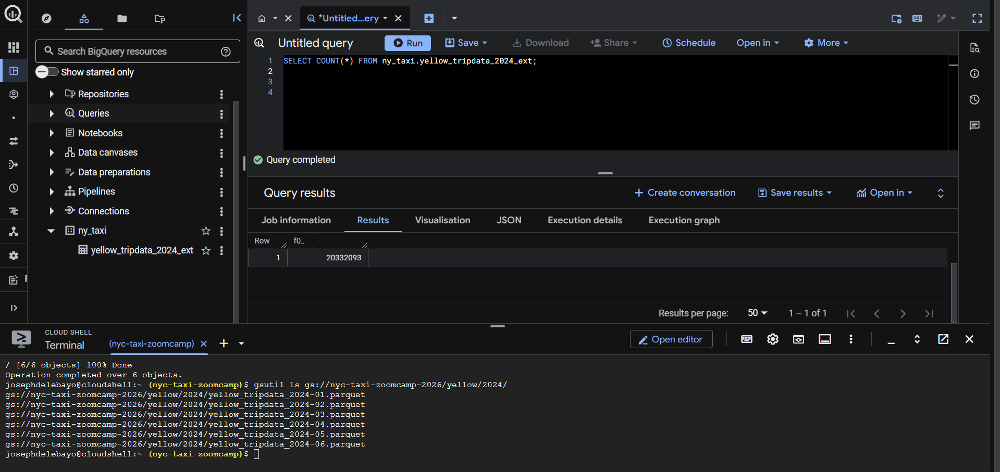
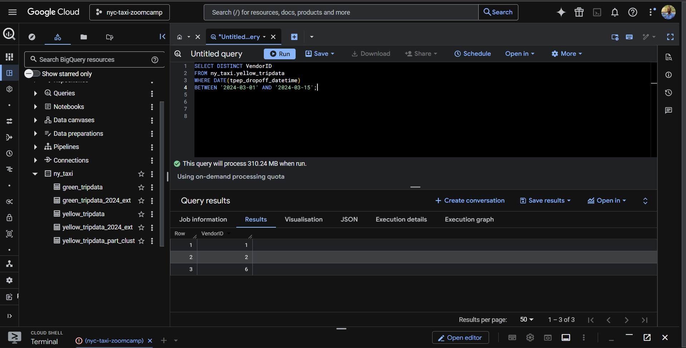

# Week 03 – Data Warehousing (BigQuery)

This folder contains my Week 3 work for the **DataTalks.Club Data Engineering Zoomcamp (2026 cohort)**.

The focus of this week was **data warehousing in BigQuery**, working with external tables, materialized tables, and optimized storage strategies using partitioning and clustering.

---

## Context

After workflow orchestration in Week 2, this week moved the pipeline into the analytical layer using **Google BigQuery**.

The emphasis was on:

- Understanding BigQuery storage vs compute
- Working with External Tables backed by GCS
- Materializing data into native BigQuery tables
- Measuring query cost via estimated bytes processed
- Applying partitioning and clustering for performance optimization
- Verifying analytical correctness against a fixed dataset scope

All work was performed inside the **GCP Console (BigQuery + Cloud Storage)**.

---

## Dataset Scope (Important)

To strictly match **Zoomcamp’s expected dataset**, the scope was intentionally constrained:

- **Yellow Taxi**: 2024-01 → 2024-06
- **Green Taxi**: 2024-03 → 2024-06

Any excess months were removed at the storage layer (GCS) **before materialization**, ensuring all queries operate on the same data volume used by the course.

---

## Tables Created

### External Tables (GCS-backed)

- `ny_taxi.yellow_tripdata_2024_ext`
- `ny_taxi.green_tripdata_2024_ext`

These tables reference Parquet files stored in a GCP bucket and do not store data inside BigQuery.

---

### Materialized Tables

- `ny_taxi.yellow_tripdata`
- `ny_taxi.green_tripdata`

These are native BigQuery tables created from the external tables to enable accurate query planning, cost estimation, and optimization.

---

### Optimized Table (Partitioned & Clustered)

- `ny_taxi.yellow_tripdata_part_clust`

Optimization strategy:

- **Partitioned by** `tpep_dropoff_datetime`
- **Clustered by** `VendorID`

This table was created specifically to evaluate performance differences when filtering by date ranges and ordering by vendor.

---

## Homework 3 Verification

The following evidence was produced directly from BigQuery executions.

---

### Question 1 – Record Count (Yellow Taxi 2024)

- Query executed on the native BigQuery table

!

- Screenshot showing `SELECT COUNT(*) FROM ny_taxi.yellow_tripdata;`

---

### Question 4 – Records with fare_amount = 0

- Query executed on the native BigQuery table

- Screenshot showing `fare_amount = 0` count result

---

### Question 6 – Bytes Processed (Partitioned vs Non-partitioned)

- Query filtered between `2024-03-01` and `2024-03-15`

- Screenshot showing ~310 MB processed for non-partitioned table

---

## Key Learnings

- BigQuery cost and performance are determined by **bytes scanned**, not row counts. Understanding how tables are stored is critical for correct query design.

- External tables are excellent for exploration and ingestion, but **materialized tables are required** for accurate cost estimation, optimization, and production-grade analytics.

- Partitioning and clustering are only effective when they align with **actual query access patterns**. Partitioning on unused columns provides no benefit.

- Dataset scope matters. Querying the correct subset of data at the storage level prevents downstream ambiguity and invalid comparisons.

---

## Known Trade-offs

- External tables were retained for transparency, but analytical queries were executed against materialized tables to avoid misleading cost estimates.

- Dataset scope was enforced manually at the GCS layer rather than dynamically filtered at query time to ensure deterministic homework results.

- Optimization focused on **read efficiency**, not ingestion speed or storage minimization.

- Only BigQuery-native optimizations were explored; downstream BI or caching layers were intentionally out of scope.

---

## Notes

This repository intentionally includes **only final artifacts and verification evidence** relevant to the coursework.

Temporary experiments, discarded queries, and exploratory steps are excluded to maintain signal clarity and reproducibility.

⬅ [Project repository](https://github.com/AsherJD-io/nyc-taxi-data-platform)  
⬅ [Week 2 – Workflow Orchestration (Kestra)](https://github.com/AsherJD-io/nyc-taxi-data-platform/tree/main/02-workflow-orchestration)
