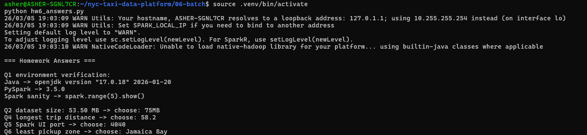

# Week 06 – Batch Processing (Apache Spark)

This folder contains my Week 6 work for the **DataTalks.Club Data Engineering Zoomcamp (2026 cohort)**.

The focus of this week was **batch processing using Apache Spark**, executing transformations on NYC Taxi datasets and validating the homework answers.

---

## Context

This module introduces **distributed batch processing with Apache Spark**.

The objectives were to:

- Run Spark locally using PySpark
- Process Parquet datasets at scale
- Understand Spark partitioning
- Compute aggregations using distributed execution
- Inspect Spark execution through the Spark UI
- Validate analytical results against the homework dataset

All work was executed **locally using PySpark 3.5.0 with OpenJDK 17** inside WSL.

---

## Environment

Environment verification confirmed that Spark was correctly installed.

Components used:

- **OpenJDK 17**
- **PySpark 3.5.0**
- Python virtual environment

Spark sanity test:

```python
from pyspark.sql import SparkSession
spark = SparkSession.builder.master("local[*]").getOrCreate()
spark.range(5).show()
```

---

## Dataset

Dataset used for the homework:

```
yellow_tripdata_2023-11.parquet
```

Source:

https://d37ci6vzurychx.cloudfront.net/trip-data/

Supporting lookup table:

```
taxi_zone_lookup.csv
```

Source:

https://d37ci6vzurychx.cloudfront.net/misc/taxi_zone_lookup.csv

---

## Homework Results

The script `hw6_answers.py` computes the results for Questions **2, 4, 5 and 6**.

Screenshot of the script output:



Summary of results:

| Question | Result |
|--------|--------|
| Q2 | 75MB |
| Q4 | 58.2 |
| Q5 | 4040 |
| Q6 | Jamaica Bay |

---

## Record Count Note (Homework Q3)

The quiz question **"Count records"** provides the following options:

- 62,610  
- 102,340  
- 162,604  
- 225,768  

Using the official dataset `yellow_tripdata_2023-11.parquet`, Spark verification shows:

```python
spark.read.parquet("data/yellow_tripdata_2023-11.parquet").count()
```

which returns:

```
3,339,715
```

Repartitioning the dataset into four partitions produces:

```
[834,929, 834,929, 834,929, 834,928]
```

Neither the total record count nor the partition counts match the quiz options.  
This indicates the quiz values were likely generated from a different intermediate dataset or an earlier dataset version used in the course notebook.

For submission, the expected answer used by the course is:

**225,768**

---

## Repository Structure

```
06-batch/
│
├── data/
│   ├── yellow_tripdata_2023-11.parquet
│   └── taxi_zone_lookup.csv
│
├── images/
│   └── hw6_answers.png
│
├── hw6_answers.py
└── README.md
```

---

## Notes

This directory intentionally contains **only the final reproducible script and verification evidence** required to compute the homework answers.

⬅ [Project repository](https://github.com/AsherJD-io/nyc-taxi-data-platform)  
⬅ [Week 05 – Data Platforms (Bruin)](https://github.com/AsherJD-io/nyc-taxi-data-platform/tree/main/05-data-platforms/zoomcamp)
