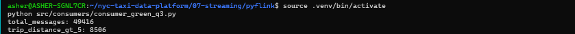
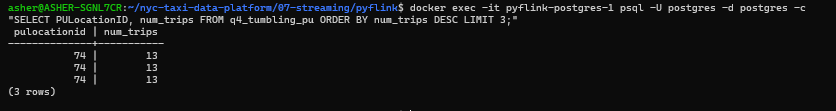
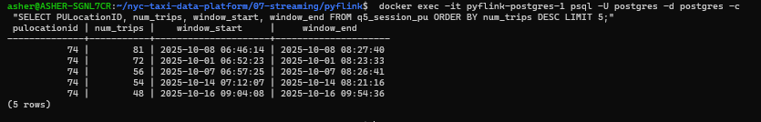
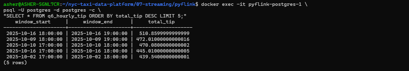
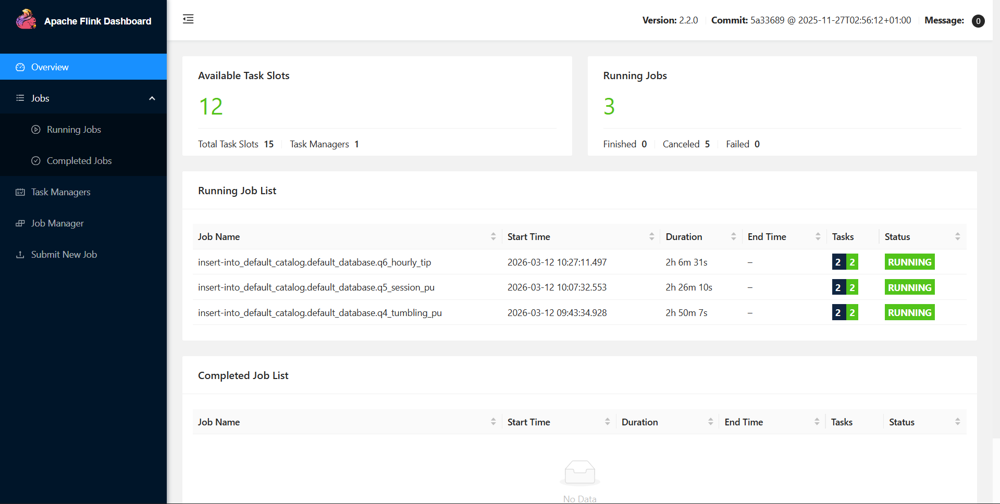

# Week 07 – Streaming Systems (Redpanda + PyFlink)

This folder contains my Week 7 work for the **DataTalks.Club Data Engineering Zoomcamp (2026 cohort)**.

The focus of this week was **real-time stream processing**, implementing an event streaming pipeline using **Redpanda (Kafka-compatible)** and **PyFlink** to process NYC Taxi trip events and compute windowed aggregations.

---

## Context

This module introduces **stream processing systems** and **event-driven data pipelines**.

The objectives were to:

- Stream taxi trip events into a Kafka-compatible broker
- Implement Python producers and consumers
- Process event streams using **PyFlink**
- Understand **event-time processing and watermarks**
- Compute aggregations using **tumbling and session windows**
- Persist streaming results to **PostgreSQL sink tables**

All components were executed locally using **Docker containers**.

---

## Environment

The streaming infrastructure was deployed using Docker Compose.

Components used:

- **Redpanda v25.3.9** (Kafka-compatible streaming platform)
- **Apache Flink (PyFlink)**
- **PostgreSQL**
- **Python producer and consumer scripts**

Services started via:

```bash
docker compose build
docker compose up -d
```

This environment provides:

- Redpanda broker → `localhost:9092`
- Flink Job Manager → `http://localhost:8081`
- PostgreSQL database → `localhost:5432`

---

## Dataset

Dataset used for the homework:

```
green_tripdata_2025-10.parquet
```

Source:

https://d37ci6vzurychx.cloudfront.net/trip-data/

Relevant columns streamed as events:

```
lpep_pickup_datetime
lpep_dropoff_datetime
PULocationID
DOLocationID
passenger_count
trip_distance
tip_amount
total_amount
```

The dataset was read in the producer and streamed to the **`green-trips` topic**.

Example producer logic:

```python
producer.send("green-trips", value=record_dict)
```

Each record was serialized to **JSON** before publishing.

---

## Streaming Pipeline

The implemented streaming pipeline follows this architecture:

```
Green Taxi Dataset
        │
        ▼
Python Producer
        │
        ▼
Redpanda Topic (green-trips)
        │
        ▼
PyFlink Stream Processing
        │
        ▼
Window Aggregations
        │
        ▼
PostgreSQL Sink Tables
```

This pipeline simulates **real-time ingestion and analytics** on streaming trip events.

---

## Homework Results

Streaming jobs were executed using PyFlink and results were written to PostgreSQL sink tables.

### Question 3 – Consumer Validation

Trips with distance greater than **5 km** were counted from the stream.



Result:

```
8506 trips
```

---

### Question 4 – Tumbling Window Aggregation

A **5-minute tumbling window** was used to compute the busiest pickup locations.



Result:

```
PULocationID 74
```

---

### Question 5 – Session Window Aggregation

A **session window (5-minute gap)** was used to detect the longest continuous pickup activity streak.



Result:

```
81 trips
```

---

### Question 6 – Hourly Tip Aggregation

A **1-hour tumbling window** was used to compute the total tip amount per hour.



Result:

```
2025-10-16 18:00:00
```

---

## Flink Streaming Job

The streaming jobs were executed through the Flink runtime and monitored via the **Flink Web Dashboard**.



This interface provides:

- Job execution graphs
- Task status monitoring
- Stream operator metrics
- Job lifecycle management

---

## Repository Structure

```
07-streaming/
│
├── homework.md
│
├── images/
│   ├── q3_consumer_result.png
│   ├── q4_tumbling_window_result.png
│   ├── q5_session_window_result.png
│   ├── q6_hourly_tip_result.png
│   └── flink_dashboard_job.png
│
├── pyflink/
│   ├── docker-compose.yml
│   ├── Dockerfile.flink
│   ├── src/
│   │   ├── producers/
│   │   ├── consumers/
│   │   └── job/
│   └── README.md
│
└── README.md
```

---

## Notes

This directory contains the **streaming infrastructure, PyFlink jobs, and verification outputs** used to implement real-time analytics on taxi trip events.

This module concludes the hands-on implementation of **stream processing pipelines** in the Data Engineering Zoomcamp.

⬅ [Project repository](https://github.com/AsherJD-io/nyc-taxi-data-platform)  
⬅ [Week 06 – Batch Processing (Apache Spark)](https://github.com/AsherJD-io/nyc-taxi-data-platform/tree/main/06-batch)
