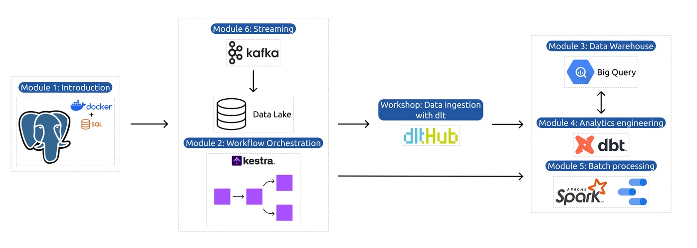

# 🚕 NYC Taxi Data Platform — Data Engineering Zoomcamp

Author

Asher
Data Engineering Zoomcamp Participant (2026)

---

## Project Structure

```text
NYC Taxi Data Platform — Data Engineering Zoomcamp/
├── README.md
├── .gitignore
├── Project Overview
├── Architecture Diagram
├── Environment Setup
├── Technologies Used
├── Week-by-Week Breakdown
│   ├── Week 1 – Docker, SQL & Terraform
│   ├── Week 2 – Workflow Orchestration (Kestra)
│   ├── Week 3 – Data Warehousing
│   ├── Week 4 – Analytics Engineering
│   ├── Week 5 – Data Platforms
│   │   ├── Bruin pipelines
│   │   └── Ingestion with dlt
│   ├── Week 6 – Batch Processing
│   ├── Week 7 – Streaming
│   └── Week 8–9 – Capstone
├── Key Learnings
├── Known Issues & Tradeoffs
└── Initializing the Project
```
---

## PROJECT OVERVIEW

This repository documents my work throughout the DataTalks.Club Data Engineering Zoomcamp, a 9-week, hands-on program focused on building production-grade data pipelines.

Using NYC Taxi trip data as a unifying dataset, the project incrementally evolves from a local, containerized ingestion pipeline into a cloud-based, orchestrated, analytics-ready data platform.

Capstone project: **Energy Decision Support System (Energy DSS)** → https://github.com/AsherJD-io/energy-decision-support

---

## ARCHITECTURE DIAGRAM



The platform follows a layered architecture where each week adds a new capability without breaking earlier assumptions.

- Early weeks prioritize local reproducibility

- Mid weeks introduce control planes and analytics layers

- Later weeks focus on scale, reliability, and tradeoffs

---

## ENVIRONMENT SETUP

This project was developed using a local-first, reproducible setup.

---

### Local Environment

- OS: Windows 11 Pro

- Subsystem: WSL2 (Ubuntu)

- Container Runtime: Docker & Docker Compose

- Language: Python (virtualenv / poetry)

- PostgreSQL & pgAdmin

- IaC: Terraform (installed locally)

---

### Design Principles

- No local database installations

- All services run in containers

- No credentials or state files committed to Git

- Each week is isolated but composable

---

## Technologies Used

### Core
- Docker
- PostgreSQL
- Python
- Terraform

### Orchestration & Analytics
- Airflow
- dbt
- BigQuery

### Streaming & Batch
- Kafka
- Spark

### Tooling
- Git
- GitHub

<p align="center">
  
  
  
  
  
  
  
  
</p>

---

## Week-by-Week Breakdown (Official Zoomcamp Structure)

### Week 1 — Docker, SQL & Terraform
- Dockerized PostgreSQL and pgAdmin
- Python-based ingestion pipeline
- SQL exploration on NYC Taxi data
- Terraform fundamentals (init & project structure)

📁 [`01-docker-terraform`](./01-docker-terraform)
📝 [Detailed notes →](./01-docker-terraform/README.md)

### Week 2 — Workflow Orchestration (Airflow)
- DAG authoring and scheduling
- Retries, backfills, and parameterization
- Pipeline orchestration patterns

📁 [`02-workflow-orchestration`](./02-workflow-orchestration)
📝 [Detailed notes →](./02-workflow-orchestration/README.md)

### Week 3 — Data Warehousing
- Analytical schema design
- Partitioning strategies
- Warehouse performance considerations

📁 [`03-data-warehouse`](./03-data-warehouse)
📝 [Detailed notes →](./03-data-warehouse/README.md)

### Week 4 — Analytics Engineering
- dbt models and transformations
- Tests and documentation
- Metrics layer design

📁 [`04-analytics-engineering`](./04-analytics-engineering)
📝 [Detailed notes →](./04-analytics-engineering/README.md)

### Week 5 — Data Platforms
- Ingestion with `dlt`
- Declarative ingestion
- Schema evolution and platform abstractions

📁 [`05-data-platforms`](./05-data-platforms)
📝 [Detailed notes →](./05-data-platforms/README.md)

### Week 6 — Batch Processing
- Large-scale batch processing
- Backfills and reruns
- Performance tradeoffs

📁 [`06-batch`](./06-batch)
📝 [Detailed notes →](./06-batch/README.md)

### Week 7 — Streaming
- Kafka fundamentals
- Producers and consumers
- Real-time vs batch comparisons

📁 [`07-streaming`](./07-streaming)
📝 [Detailed notes →](./07-streaming/README.md)

### Week 8–9 — Capstone (Energy Decision Support System)
- End-to-end system design
- Architecture iteration
- Lessons learned

🔗 Project repo → [Energy Decision Support System (Energy DSS)](https://github.com/AsherJD-io/energy-decision-support)
📄 Project documentation → [energy-decision-support/README.md](https://github.com/AsherJD-io/energy-decision-support/blob/main/README.md)

---

## Key Learnings

- Local reproducibility is foundational

- Orchestration is a control plane, not a scheduler

- Analytics engineering bridges data and decision-making

- Production readiness starts early

- Tradeoffs matter more than tools

---

## Known Issues & Tradeoffs

- Local Docker environments do not reflect cloud scale

- CSV ingestion is instructional, not production-optimal

- Some datasets are sampled to manage resource usage

- All tradeoffs are explicitly documented in weekly READMEs.

---

## Initializing the Project

```bash
git clone https://github.com/AsherJD-io/nyc-taxi-data-platform.git
docker compose up -d
docker compose run ingestion
```
---

### Then open pgAdmin:

- URL: http://localhost:8085

- Host: pgdatabase

- Database: ny_taxi
